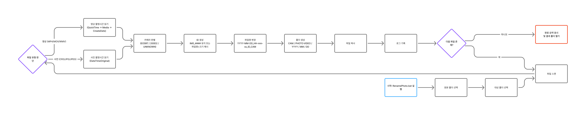

# 📷 Photo & Video Rename + Copy Tool

This is a Windows tool that uses **PowerShell** and **exiftool** to  
automatically organize photos and videos based on **capture time, camera, and media type**.

It works with a GUI (folder selection dialogs), so  
👉 **no command-line input is required — just double-click to run**.

---

## ✨ Key Features

- Automatically scans photo and video files
- Extracts capture time using EXIF / QuickTime metadata
- Automatically detects Canon EOS R7 / EOS 200D II cameras
- Renames files using a consistent, readable naming rule
- Organizes files by camera / photo·video / date
- Safely handles duplicate files (prevents overwriting)
- Shows progress bar during processing
- Generates detailed processing logs

---

## 📁 Supported File Types

### 📸 Photos (PHOTO)
- CR3
- JPG / JPEG

### 🎥 Videos (VIDEO)
- MP4
- MOV
- WMV

---

## 🏷️ File Naming Rule

```
YYYY-MM-DD_HH-mm-ss_<ID>_<CAM>.EXT
```

### Examples
```
2025-12-15_11-08-27_0300_EOSR7.JPG
2025-12-15_14-03-11_A3F9C2_UNKNOWN.MOV
```

---

## 🔑 ID Generation Rules

### 1️⃣ Files named `IMG_####`
- Example: `IMG_0300.JPG`
- → Uses **0300** directly as the ID

### 2️⃣ Other filenames
- ID = `hash6("original filename | file size")`
- Always generates the **same ID on every run**
- Prevents collisions or infinite loops when multiple files share the same timestamp

---

## 📷 Camera Detection Rules

| Camera Model | Label Used |
|-------------|-----------|
| Canon EOS R7 | EOSR7 |
| Canon EOS 200D II | 200D2 |
| Others / Unknown | UNKNOWN |

---

## 🕒 Capture Time Priority

### 📸 Photos
1. DateTimeOriginal
2. LastWriteTime (fallback)

### 🎥 Videos
1. QuickTime:CreateDate
2. QuickTime:MediaCreateDate
3. MediaCreateDate
4. CreateDate
5. LastWriteTime (fallback)

---

## 🗂️ Folder Structure

```
<DESTINATION>
 └─ EOSR7
    ├─ PHOTO
    │  └─ YYYY / MM / DD
    └─ VIDEO
       └─ YYYY / MM / DD
```

---

## ▶ How to Run

1. Double-click `RenamePhoto.bat`
2. Select the **source folder** (original photos/videos)
3. Select the **destination folder**
4. Processing starts automatically
5. When finished, the destination folder opens automatically

👉 For detailed instructions, see **HowToUse.md**

---

## 🔧 Requirements

- Windows 10 / 11
- PowerShell 5.1 or later
- **exiftool**
  - https://exiftool.org/
  - Place at: `exiftool/exiftool.exe`

> ⚠️ exiftool binary is **not included** in this repository due to licensing.

---

## 📄 License

- Script code: **MIT License (recommended)**
- exiftool is distributed under its own license

---

## 📌 Documentation

- [HowToUse.md](./RenamePhoto_HowToUse.md)
- [CHANGELOG.md](./RenamePhoto_CHANGELOG.md)

---

### 📎 Processing Flow Diagram


